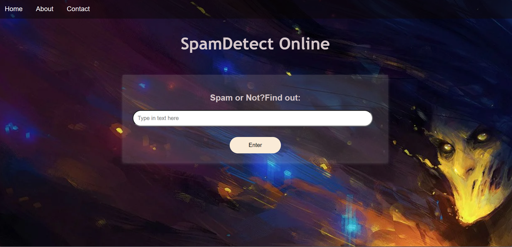

## Spam Detection with TensorFlow and BERT

This project involves building a spam detection model using TensorFlow and the BERT (Bidirectional Encoder Representations from Transformers) model. The code is organized in the `spam_detect_app/app.py` file and containerized using Docker. The primary goal of this project is to create an API for spam detection, and it now includes a user-friendly UI for single text classification alongside the API.

### Overview
Spam detection is a critical task in modern communication systems, and this codebase utilizes advanced natural language processing (NLP) techniques to identify and classify spam messages. The project consists of several key components:

1. **Data Loading and Preprocessing**: The code loads a dataset of preprocessed spam messages, which is essential for training and testing the spam detection model.

2. **Text Embedding with BERT**: BERT, a powerful NLP model, is used to embed text data. This embedding captures contextual information, making it highly suitable for text classification tasks. The code utilizes TensorFlow Hub to access pre-trained BERT models for text preprocessing and embedding.

3. **Data Vectorization**: The text data is vectorized using TensorFlow's TextVectorization layer, preparing it for input to the machine learning model.

4. **Model Creation**: The spam detection model is constructed using a combination of embedding, LSTM layers, and dense layers. The model is trained to classify messages as spam or not spam.

5. **Data Pipeline**: The code defines a data pipeline that prepares and processes the training data, including caching, shuffling, batching, and prefetching to optimize training efficiency.

6. **Training and Model Saving**: The model is trained with the provided data and saved for future use.

7. **API for Spam Detection**: The code now includes a fully implemented RESTful API for spam detection using Flask and Python. Users can send text messages to the API for spam classification.

8. **User Interface (UI)**: In addition to the API, a user-friendly UI is provided for single text classification. Users can enter a text message, click a button, and get immediate spam classification results.

### Use and Development
To use this code:

1. Load the dataset of preprocessed spam messages.
2. Use the BERT-based embedding function to embed the text data.
3. Vectorize the embedded data for model input.
4. Split the data into training and testing sets.
5. Build and train the spam detection model.
6. Save the trained model for future use.
7. Utilize the RESTful API for spam detection, where you can send text messages for classification.
8. Enjoy the user-friendly UI for single text classification.

Please note that the model creation and training in the current code are set to a small number of epochs for testing purposes. For practical use, you should train the model with more extensive data and hyperparameter tuning.

### Future Directions
The codebase now includes a completed API for spam detection and a user-friendly UI for single text classification. Additional features and refinements will be made in subsequent development phases. This project demonstrates the integration of deep learning techniques with a user interface and REST API to provide a comprehensive spam detection solution.

#### References:
- TensorFlow: https://www.tensorflow.org/
- TensorFlow Hub: https://tfhub.dev/
- BERT: https://tfhub.dev/tensorflow/bert_en_uncased_L-12_H-768_A-12/4
- TextVectorization: https://www.tensorflow.org/api_docs/python/tf/keras/layers/experimental/preprocessing/TextVectorization
- LSTM: https://www.tensorflow.org/api_docs/python/tf/keras/layers/LSTM
- Flask: https://flask.palletsprojects.com/
- Docker: https://www.docker.com/

For more details and instructions on the API and UI usage, please refer to the project's documentation.
